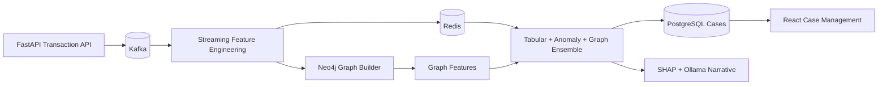

# Architecture Overview

Transactions are keyed by `account_id`, which lets Kafka partition related account behavior consistently. Redis stores short-lived velocity, merchant, device, IP, and beneficiary counters. Neo4j stores the entity network and supports graph features used by the ensemble scorer.
